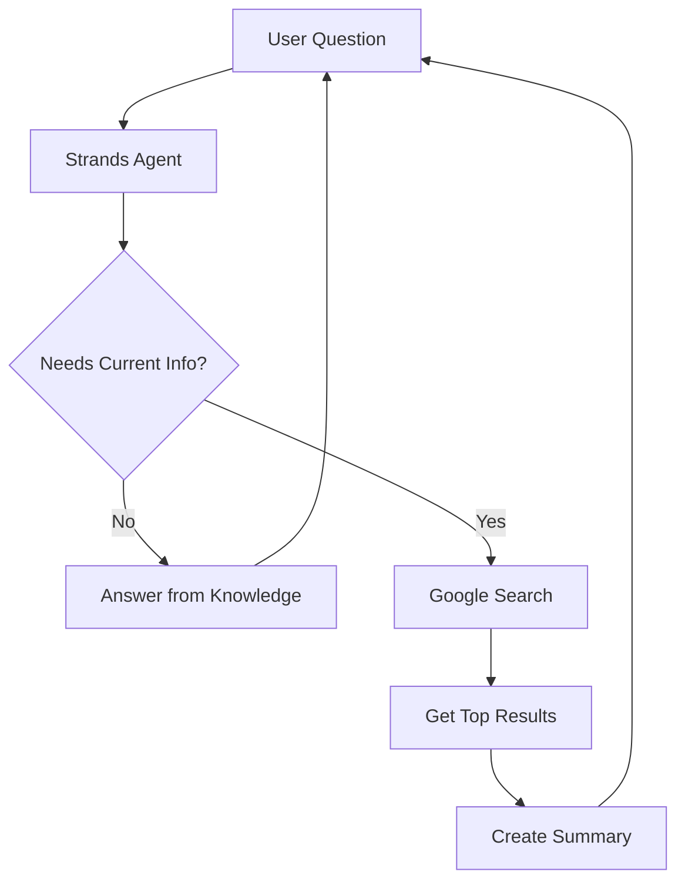

# Strands Agent Design Document

## Overview

The Strands Agent is a simple conversational AI that can search Google when it needs current information. When a user asks about something that might be recent or changing (like "latest AWS certification discounts"), the agent searches Google, reads the top results, and gives a summary answer with sources.

## Architecture

### Simple Flow



### Core Components

1. **Strands Agent**: Main class that handles user questions
2. **Google Search Tool**: Searches Google and gets results
3. **Response Generator**: Creates natural language answers

## Components and Interfaces

### Main Agent Class

```python
from dataclasses import dataclass
from typing import List

class StrandsAgent:
    def __init__(self, google_api_key: str, search_engine_id: str):
        self.google_search = GoogleSearchTool(google_api_key, search_engine_id)
    
    def ask(self, question: str) -> str:
        """Main method - user asks a question, gets an answer"""
        if self._needs_search(question):
            return self._search_and_answer(question)
        else:
            return self._static_answer(question)
    
    def _needs_search(self, question: str) -> bool:
        """Simple check if question needs current info"""
        search_keywords = ['latest', 'current', 'recent', 'today', 'this month', 'now', 'discount', 'price']
        return any(keyword in question.lower() for keyword in search_keywords)
```

### Google Search Tool

```python
@dataclass
class SearchResult:
    title: str
    snippet: str
    url: str

class GoogleSearchTool:
    def __init__(self, api_key: str, search_engine_id: str):
        self.api_key = api_key
        self.search_engine_id = search_engine_id
    
    def search(self, query: str, num_results: int = 5) -> List[SearchResult]:
        """Search Google and return top results"""
        # Uses Google Custom Search API
        pass
    
    def summarize_results(self, results: List[SearchResult], original_question: str) -> str:
        """Create a summary answer from search results"""
        # Combines result snippets into a coherent answer
        pass
```

## Error Handling

### Simple Error Strategy

1. **API Errors**: If Google Search fails, return "I couldn't search for current information right now. Please try again later."
2. **No Results**: If no search results found, return "I couldn't find current information about that topic."
3. **Invalid Questions**: For unclear questions, ask the user to be more specific.

## Testing Strategy

### Basic Testing

1. **Test the search detection**: Check if questions with words like "latest", "current" trigger search
2. **Test Google API integration**: Mock API responses to test search functionality  
3. **Test response generation**: Verify the agent creates good summaries from search results

## Implementation Notes

### Required Libraries
- `google-api-python-client` - for Google Search API
- `requests` - for HTTP requests

### Key Files to Create
1. `strands_agent.py` - Main agent class
2. `google_search.py` - Google Search API wrapper
3. `config.py` - Configuration management
4. `main.py` - Simple CLI interface for testing

### Example Usage
```python
agent = StrandsAgent(api_key="your-key", search_engine_id="your-id")
response = agent.ask("What are the latest AWS certification discounts this month?")
print(response)
# Output: "AWS is currently offering 50% exam vouchers through the re:Invent event. Sources: aws.amazon.com/certification"
```